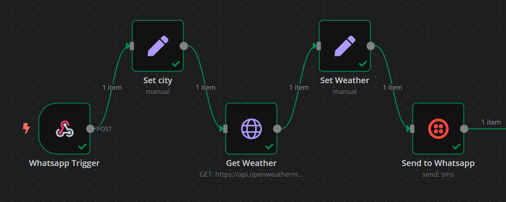

# 🌦️ WhatsApp Weather Bot

A no-code/low-code automation workflow built with [n8n](https://n8n.io) to provide **real-time weather updates via WhatsApp**. Users send a city name (e.g., `Islamabad`) to a Twilio WhatsApp Sandbox number, and the bot responds with the current temperature and weather condition using the [OpenWeatherMap API](https://openweathermap.org/api).

---

## 📸 Demo

**User sends WhatsApp message:**
```
Islamabad
```

**Bot replies:**
```
Clear - 30.1°C in Islamabad
```

---

## 🧠 Tech Stack

- **n8n**: Workflow automation engine (self-hosted or [n8n cloud](https://n8n.io/cloud))
- **Twilio WhatsApp Sandbox**: Handles WhatsApp messaging
- **OpenWeatherMap API**: Provides real-time weather data

---

## 🚀 How It Works

1. User sends a city name via WhatsApp (e.g., `London`).
2. Twilio forwards the message to an n8n Webhook.
3. n8n processes the request:
   - Extracts the city name from the message.
   - Queries the OpenWeatherMap API for weather data.
   - Formats the response (e.g., temperature and condition).
   - Sends the reply back to the user via WhatsApp.

---

## 📦 Workflow Nodes

1. **Webhook**: Receives incoming messages from Twilio.
2. **Set**: Extracts the city name from the message body.
3. **HTTP Request**: Queries the OpenWeatherMap API with the city name.
4. **Set**: Formats the weather data into a user-friendly message.
5. **Twilio**: Sends the formatted response back to WhatsApp.

---

## 📂 File Structure

```
whatsapp-weather-bot/
├── .env.example              # Example environment variables
├── workflow/
│   └── whatsapp-weather-bot.json  # n8n workflow JSON file
├── screenshots/
│   └── workflow-screenshot.png   # Screenshot of n8n workflow
├── README.md                 # Project documentation
└── LICENSE                   # MIT License file
```

---

## 📷 Workflow Screenshot



*Note: The screenshot above shows the n8n workflow with the Webhook, Set, HTTP Request, and Twilio nodes connected in sequence.*

---

## 🛠️ Setup Guide

### 1. 🧩 Prerequisites

- **Twilio Account**: Sign up at [Twilio](https://www.twilio.com) and activate the WhatsApp Sandbox.
- **OpenWeatherMap API Key**: Obtain a free API key from [OpenWeatherMap](https://openweathermap.org/api).
- **n8n Instance**: Use a self-hosted n8n instance or sign up for [n8n cloud](https://n8n.io/cloud).

### 2. 🔐 Environment Variables

Create a `.env` file based on the provided `.env.example`:

```bash
# .env.example
N8N_WEBHOOK_URL=https://your-ngrok-url.ngrok.io
OPENWEATHERMAP_API_KEY=your-openweathermap-api-key
TWILIO_ACCOUNT_SID=your-twilio-account-sid
TWILIO_AUTH_TOKEN=your-twilio-auth-token
```

If self-hosting n8n locally, use a tool like [ngrok](https://ngrok.com) to expose your webhook:

```bash
export N8N_WEBHOOK_URL=https://your-ngrok-url.ngrok.io
```

### 3. 🔗 Configure Twilio Sandbox

1. Log in to your [Twilio Console](https://www.twilio.com/console).
2. Navigate to the WhatsApp Sandbox settings.
3. In the **"When a message comes in"** field, set the webhook URL to:

```bash
https://your-n8n-domain/webhook/whatsapp_weather
```

*Note: Ensure your n8n webhook is publicly accessible. Use ngrok if running locally.*

### 4. 🔑 Set Up Credentials

#### Twilio
1. In n8n, go to **Settings > Credentials > Add Credential > Twilio API**.
2. Enter your **Account SID** and **Auth Token** from the Twilio Console.

#### OpenWeatherMap
1. Sign up at [OpenWeatherMap](https://openweathermap.org/api) to get a free API key.
2. In the n8n **HTTP Request** node, set the `appid` query parameter to your API key.

### 5. 🧪 Testing the Workflow

1. Join the Twilio WhatsApp Sandbox by sending the provided code (e.g., `join violet-dog`) to:

```bash
+1 415 523 8886
```

2. Activate the workflow in n8n.
3. Send a city name (e.g., `Karachi`) via WhatsApp.
4. Receive an instant weather update, such as:

```
Sunny - 28.5°C in Karachi
```

---

## 🧰 Use Cases

- **Customer Service Bots**: Automate responses for weather-related inquiries.
- **Real-Time Alerts**: Notify users of weather changes.
- **Data Lookups**: Extend the bot for other WhatsApp-based queries.
- **Learning Tool**: Ideal for beginners exploring n8n and chatbot development.

---

## 🙋‍♂️ Author & Contact

- **Fiverr**: [fiverr.com/nitrola](https://fiverr.com/nitrola)
- **LinkedIn**: [linkedin.com/in/ahmad-raza-403bbd0278](https://linkedin.com/in/ahmad-raza-403bbd0278)
- **Portfolio**: Coming Soon

For questions or support, feel free to reach out via LinkedIn or Fiverr.

---

## 🧾 License

This project is licensed under the [MIT License](LICENSE).

---

## ✅ Final Tips

- **Workflow File**: Import the `whatsapp-weather-bot.json` from the `/workflow` directory into n8n to set up the workflow instantly.
- **Environment Variables**: Use the `.env.example` file as a template for your environment variables.
- **Extending the Bot**: Add more nodes to enhance functionality, such as weather forecasts or multiple API integrations.
- **Security**: Keep your API keys and credentials secure. Never expose them in public repositories.

---

Enjoy building your WhatsApp Weather Bot! 🌍
